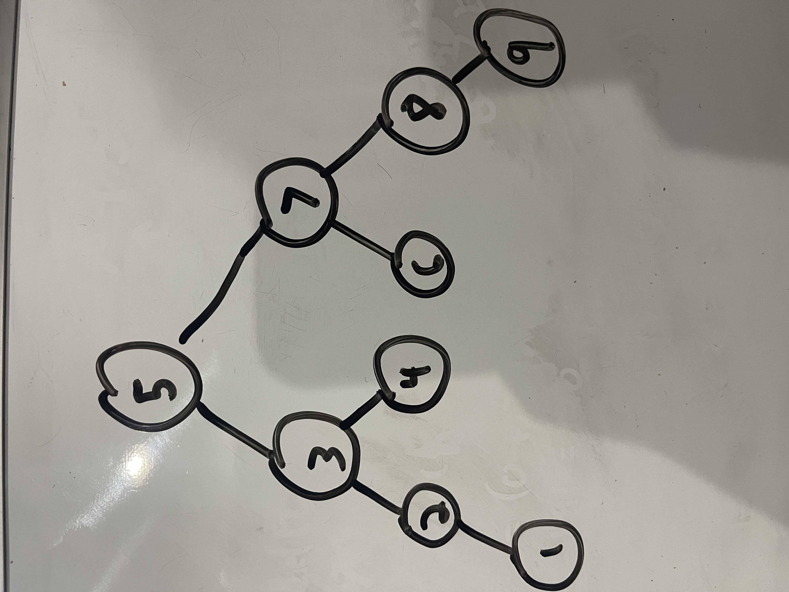

# Binary Search Tree

 Binary Search Tree is a node-based binary tree which has the following properties: 

<ul>
    <li>The left subtree of the a node only contains nodes with lesser value keys than the node's key</li>
    <li>The right subtree of the a node only contains nodes with greater value keys than the node's key</li>
    <li>Both the right and left subtree must be a binary search tree</li>
</ul>

## Example Binary Search Tree
